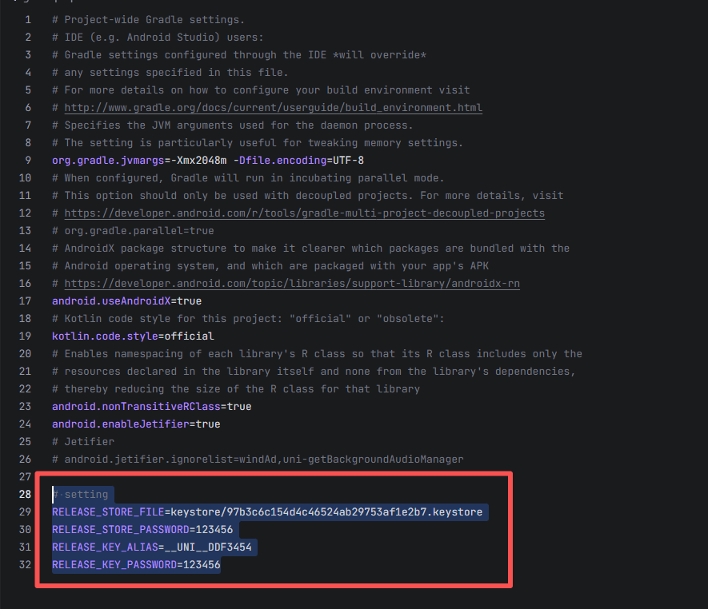

# Uni App X 安卓本地离线打包

#### 介绍：Uni App X 安卓本地离线打包喂饭教程


## 代码地址


## 特性

- [x] Github Action一键打包,无需配置Android Studio配置
- [x] 压缩混淆配置,打包"Hello" apk大小：7.7MB
- [x] HBuilder X 5.05
- [x] HBuilder X 5.05


## 环境

HBuilder X 5.05

Android Studio 2025.1.3

## 教程

#### 视频教程参考
本包是在这个博主的基础上，进行了一些添加优化，大家要看教程，跳转传送门

传送门：[https://www.bilibili.com/video/BV1yW6oBeEqy](https://www.bilibili.com/video/BV1yW6oBeEqy)

#### 图文教程

1. 使用HBuilder X打开你的uni-app x项目点击"工具栏"-"发行"-"App-Android/iOS-本地打包"-"生成本地App打包资源"

2. 因为"此项目"已有一个示例uni-app x，所以先把示例项目资源删除（不要乱删文件）：
   - 删除"此项目"的"app/src/main/assets/apps"文件夹下的所有
   - 删除"此项目"的"app/src/main/java"文件夹下的："index.kt"文件和"pages"文件夹
   
3. 将生成的"__ UNI __XXXXXX"文件夹复制到"此项目"的"app/src/main/assets/apps"文件夹下

4. 将生成的"uniappx/app-android/src"文件夹下的所有东西复制粘贴到"此项目"的"app/src/main/java"文件夹下

5. gradle.properties配置自己的相关签名
   

5. 使用Android Studio打开"此项目",直接打包即可。

   > 打包apk，在"此项目"的根目录打开命令行，执行：
   >
   > ```
   > gradlew assembleRelease
   > ```


## 鸣谢

https://github.com/BrokenDreamTech/UniAppxPack

## 📄 License

#### [Apache License 2.0](./LICENSE.txt)